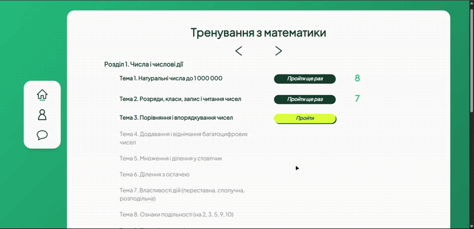
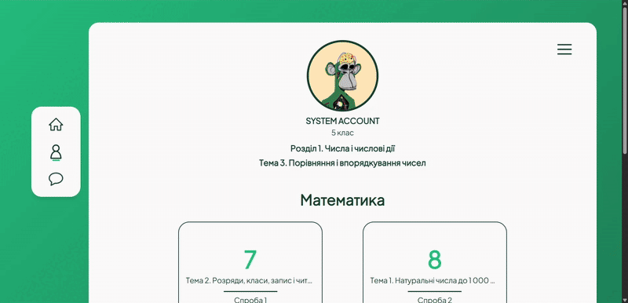
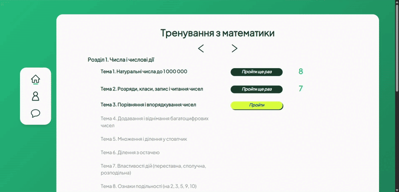
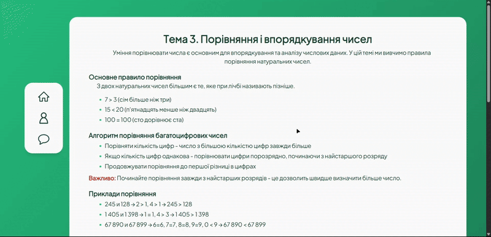

  <h1>Six7 - MATH & PHYSICS EDUCATION</h1>
  
<strong>A full-stack educational platform for Mathematics and Physics</strong>

  
<em>Interactive learning, automated practice, progress tracking, and administration in one system.</em>

---

  

## 🚀 Overview

**Six7 - MATH & PHYSICS EDUCATION** is a full-stack educational platform designed for students in grades 5–9.

The platform combines structured theory, practical exercises, automatic answer validation, progress tracking, user accounts, administrative tools, and real-time communication.

The project is built as a complete production-oriented web application, including frontend, backend, PostgreSQL database, Redis, Docker infrastructure, CI workflows, security controls, backups, and deployment configuration.

---

## 🛠 Tech Stack

### Frontend

* **Next.js 15** with App Router
* **React 19**
* **TypeScript**
* **Redux Toolkit**
* **Tailwind CSS**
* **SCSS**
* **Socket.IO Client**

### Backend

* **Node.js 22**
* **Express.js**
* **TypeScript**
* **PostgreSQL 17**
* **Prisma ORM**
* **Redis**
* **Socket.IO**
* **JWT Authentication**
* **Nodemailer**
* **Winston**
* **Multer + Sharp**

### Infrastructure

* **Docker & Docker Compose**
* **Nginx**
* **Cloudflare**
* **GitHub Actions**
* **Automated PostgreSQL backups**
* **Maintenance jobs**
* **Log rotation**

---

  

## ✨ Features

* Structured educational content for Mathematics and Physics.
* Mathematics curriculum for grades **5–9**.
* Algebra and Geometry content for grades **7–9**.
* Mathematics preparation materials for **NMT / ZNO**.
* More than **16,000 validated practice tasks**.
* Algorithmic generation of task values and answer variants.
* Multiple task formats, including:
  * single choice
  * multiple choice
  * matching
  * ordering
  * numeric input
  * multi-field tasks
* Automatic answer validation and instant feedback.
* Student progress tracking and result history.
* Secure account registration and authentication.
* Password recovery and account recovery flows.
* Profile and account management.
* Role-based user and administrator access.
* Administrative dashboard and student management.
* Real-time notifications and communication using Socket.IO.
* Email notifications for account and security events.
* Responsive interface for desktop and mobile devices.

---

  

## 🧠 Task Generation & Validation

Six7 includes a custom task-bank and generation system for mathematical exercises.

The generator supports:

* Dynamic variables and constraints
* Generated numeric values
* Automatic distractor generation
* Structured answer templates
* Multiple answer formats
* Validation of generated tasks
* Task-bank auditing before deployment

The current task bank contains more than **16,000 validated tasks** across **302 educational tests**.

---

## 🏗 Architecture

The application follows a modular architecture with clear separation between:

* Routes
* Controllers
* Services
* Validation
* Authentication
* Database access
* Real-time communication
* Educational data
* Task generation

Prisma provides type-safe PostgreSQL access, while Redis is used for temporary application state such as rate limits, password-reset sessions, practice sessions, and cached data.

The frontend and backend are deployed as separate services and communicate through a dedicated API.

---

  

## 🔐 Security

Six7 includes several security mechanisms designed for production use:

* HTTP-only authentication cookies
* Short-lived access tokens
* Refresh-token session management
* Role-based authorization
* Password hashing with bcrypt
* Login and registration attempt limiting
* Redis-backed rate limiting
* Password-reset session isolation
* Account recovery
* Suspicious-session termination
* Google reCAPTCHA
* Restricted CORS configuration
* Helmet security headers
* Request body limits
* Secure profile-image validation and processing
* Reverse-proxy-aware client IP handling

---

## 🐳 Production & DevOps

The project includes a complete Docker-based infrastructure for local development and production deployment.

Production configuration includes:

* Docker Compose
* Nginx reverse proxy
* Cloudflare integration
* PostgreSQL and Redis persistence
* Health checks
* Automated PostgreSQL backups
* Backup integrity validation
* Automatic maintenance cleanup
* Log rotation
* GitHub Actions CI
* Production build and lint validation

---

## 🎯 Project Goals

* Build a real educational product rather than a simple demo.
* Maintain a clean and modular codebase.
* Provide secure authentication and account management.
* Support a large and extensible educational task bank.
* Keep the application scalable and maintainable.
* Prepare the infrastructure for reliable production deployment.
* Continue expanding Mathematics and Physics content.

---

  <h3>Developer</h3>

  <strong>Artem Zhyto</strong>

    

  <a href="https://github.com/ArtemZhyto">GitHub Profile</a>

    

  <em>Designed, developed, and maintained as a complete full-stack project.</em>

